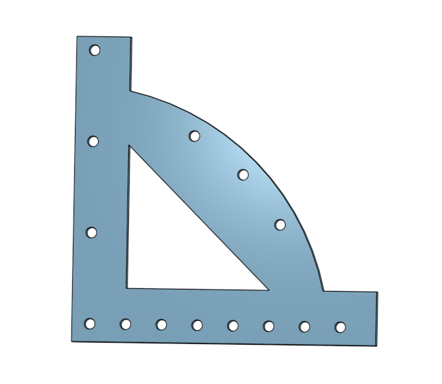

# IntermediateCad

## Multi-Tool Part 1

### Description

This assingment was to build the fist part of a multi tool using onshape.

### Evidence

#### Reflection

When first looking at the drawing I did'nt know what to do for the dimensions of the arc. Mr. Helmsetter told me that if there are no specific dimensions you just can assume its a normal circle. I then learned to use a center point arc on the origin to create the arc itself

## Multi-Tool Drawing

### Description

This assingment was to convert the Multi-tool into a drawing and then export it to be laser cut.

### Evidence

#### Reflection

The biggest problem I ran into is when I exported the drawing into the Print me google doc, the curved line would go away. This is just a visual thing, and not a problem. The line is so thin that it doesn't show up but It is still good to be printed.

## Multi-Tool-3 Editing and assembly

### Description

This assingment was to add a wrench in the multi tool using a bolt inserted in assembly. This was done with editing in context

### Evidence

#### Reflection

When I tryed to extrude remove the bolt shape, the bolt from assembly kept getting in the way. To fix this, I just used the edge lines of the bolt, and deleted the bolt in assemnbly.
